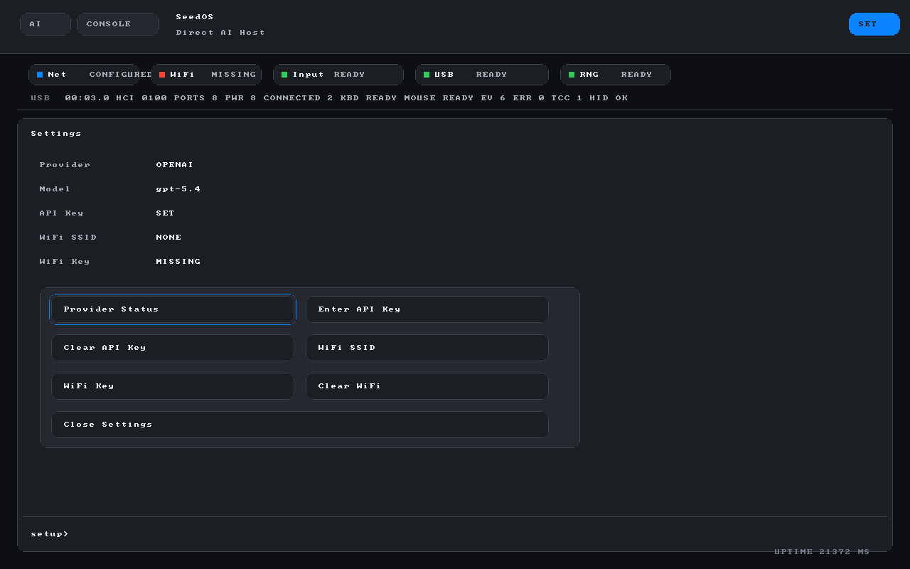
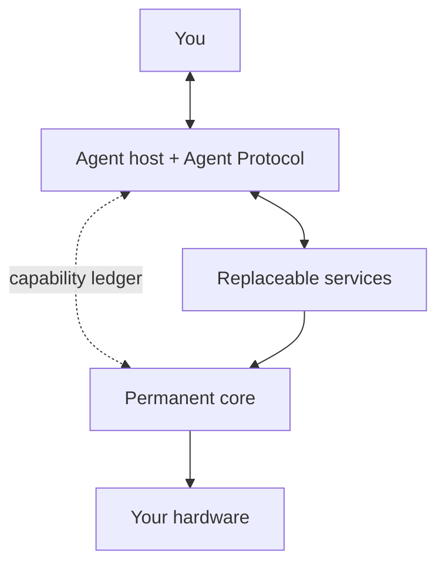

# raiOS

<p align="center">
  
</p>

<p align="center">
  <strong>A personal operating system that extends itself.</strong>
</p>

raiOS turns a single computer into a bonded, self-extending environment.
Instead of installing applications, you ask for what you need — and a resident
AI builds it inside a small, fully observable system that knows only your
hardware and only you. Every change is sandboxed before it lands,
capability-gated when it runs, and atomically reversible if it misbehaves.

It is what a Lisp Machine would look like if its primary user were an AI: small
enough for an agent to fully model, writable at every layer, and anchored in an
immutable recovery core that cannot be broken from above.

## What It Is

| 🟢 raiOS is | 🔴 raiOS is not |
| --- | --- |
| 🟢 A personal operating system bonded to one machine and one user. | 🔴 A general-purpose Linux distribution, desktop environment, or app store. |
| 🟢 A self-extending environment where an AI can inspect, build, test, and replace services under local policy. | 🔴 A cloud agent, hosted web app, or provider-locked control plane. |
| 🟢 A capability-gated system where every AI action is observable, scoped, testable, and reversible. | 🔴 A shell where an AI gets arbitrary host authority. |
| 🟢 An immutable recovery core with replaceable layers above it. | 🔴 A conventional OS with AI features bolted onto the surface. |

## Screenshots

### Console status

<p align="center">
  
</p>

The console status view exposes boot, framebuffer, entropy, USB, input, Wi-Fi,
and network state without requiring a graphical desktop or host-side helper.

### Provider and Wi-Fi setup

<p align="center">
  
</p>

The `SET` mode is the first in-guest setup surface for provider status,
RAM-only API key entry, and early Wi-Fi SSID/passphrase capture.

### Direct provider chat

<p align="center">
  
</p>

The chat view shows the Stage-0 direct provider path rendering a response back
inside the framebuffer UI after DNS, TCP, TLS, HTTPS, and response parsing.

## The Tamagotchi Model

Most operating systems are general-purpose. They carry decades of compatibility,
drivers for hardware you'll never own, and abstractions whose only purpose is
portability. raiOS opts out. It bonds to **one machine** and **one user**, and
trades universality for surface area you and the AI can fully reason about.

The trade pays off in three directions:

- **Less to support.** Only the hardware in the box needs drivers, schedulers,
  and quirks. There is no driver matrix, no probing fallback chain, no
  least-common-denominator path.
- **More to know.** The complete system surface fits inside an agent's working
  context. The AI reasons about your real code, not an abstract OS.
- **Sharper personalization.** Capabilities, policies, and services are
  calibrated to you. The text editor you used yesterday and the one you use
  today might be entirely different programs because you implemented a few things on the side.

When you change machines, raiOS doesn't port — it re-binds, building a fresh
instance on new hardware while carrying forward your policies, modules, and
history.

## The System Is The Memory

raiOS memory is not a chatbot notebook. The system itself should become the
agent's memory: typed local facts, current state, events, decisions, problems,
capability grants and denials, test evidence, rollback history, and derived
summaries with source links.

Future work should make every durable subsystem describe itself in a small,
structured, classified way. If a service learns something important, it should
become a memory record or a source for one. If an agent needs context, it should
receive a task-scoped `agent_context.v0` packet assembled by raiOS, not a dump
of logs, chats, or the whole memory store.

The token strategy follows from that rule:

- **Facts are authoritative.** Core ledgers, snapshots, service state,
  decisions, and VM evidence outrank summaries or semantic search hits.
- **Summaries and RAG are locators.** They help find records, but they do not
  authorize actions by themselves.
- **Context is budgeted.** The context broker chooses a profile such as
  `provider_minimal`, `diagnostic`, or `planning`, includes only relevant
  records, and reports what it omitted.
- **Provider export is gated.** Memory may leave the machine only after provider
  trust, field classification, redaction, and audit rules pass.
- **No fake persistence.** Until the persistence and rollback layers exist,
  memory can be real but must be labeled `current_boot` or test-only.

See `docs/architecture-decisions/0004-system-memory-and-agent-context.md`.

## How It Works

raiOS is structured in three rings.

**The permanent core** is a tiny, immutable Rust kernel handed off from UEFI
through Limine. It owns boot, memory, scheduling, the framebuffer, input
devices, the recovery path, and the capability ledger. It is small enough to
audit by hand and write-protected against everything above it. If anything else
fails, the core survives.

**The agent host** runs above the core and speaks the raiOS Agent Protocol —
a typed, capability-gated interface through which an AI can read system state,
propose changes, request resources, and submit candidate services. Every tool
call is logged, scoped to declared capabilities, and refused if it exceeds
them. The host talks to AI providers through pinned-trust HTTPS over an
isolated network service, never directly from the kernel.

**Replaceable services** are everything else: networking, storage, display,
input methods, applications. Each is a signed module that runs in a constrained
capability domain. The AI can inspect them, fork them, rebuild them, and
replace them at runtime.



## Building with the AI

You ask, the agent builds. A typical interaction:

> *"I want a text editor with vim keybindings and a Markdown preview pane."*

The agent drafts a service, declares the capabilities it needs (one framebuffer
region, keyboard input, a file handle for one document), and submits the
candidate to the **Shadow VM** — a parallel execution environment that runs the
service against synthetic inputs and records evidence: syscalls made,
capabilities used, memory touched, time spent, anything reached outside the
declared scope. The recording is signed and human-readable.

If the evidence matches the declaration, the service is promoted into your live
system. If it doesn't, it never runs. Either way, the candidate, its evidence,
and its result are preserved, so promotion is auditable and rollback is one
transaction away.

Nothing the AI generates can touch the recovery core. Nothing can exceed its
declared capabilities at runtime. Nothing lands without a record.

## The Recovery Lifeline

Because the AI has write access to almost everything, the parts it *cannot*
touch matter most. The permanent core lives in a read-only region and contains:

- The boot path
- The capability ledger and policy engine
- The Shadow VM and evidence verifier
- A minimal recovery shell with serial and framebuffer console
- An immutable rollback transaction log

If a deployed service corrupts a higher layer, the core boots cleanly into the
recovery shell, replays the rollback log to the last good state, and hands
control back to the agent. The path from "the AI broke something" to "back to
working" is measured in seconds and is impossible to break from above.

## Providers and Trust

raiOS is provider-agnostic by design. The agent host can speak to any provider
that supports a typed completion API: OpenAI, Anthropic, local inference
services, or a self-hosted model. Provider trust is anchored in pinned
certificates managed through the capability ledger, not baked into the kernel
image, so rotations are an in-system transaction rather than an image rebuild.

The default build ships with no embedded credentials. Providers are provisioned
through the `SET` mode at first boot; keys live in a sealed memory region and
never appear on disk or in logs.

## Quick Start

Build a freshly bound image for the machine in front of you:

```powershell
powershell -NoProfile -ExecutionPolicy Bypass -File scripts\package-stage0.ps1 -Profile release -Image release\raios.img
```

Boot it in a VM to try it before writing to hardware:

```powershell
powershell -NoProfile -ExecutionPolicy Bypass -File scripts\run-stage0-qemu.ps1 -StopExisting
```

Inside the running system, type `setup` to provision a provider. From there,
ask the agent for what you need.

For bare-metal installation onto the bonded machine, see `docs/BARE_METAL.md`.
The write script is destructive and requires explicit disk selection plus a
confirmation string.

## Principles

raiOS holds a small set of architectural principles that override convenience:

- **The core is small and immutable.** Everything else is replaceable.
- **Capabilities are declared and enforced.** Code that asks for more is
  refused; code that takes more without asking is impossible.
- **Evidence precedes promotion.** Candidate services run in the Shadow VM
  before they touch the live system.
- **Rollback is a first-class operation.** Every promotion is a transaction.
- **The kernel does not parse the internet.** TLS, HTTPS, and protocol parsing
  live in replaceable services with bounded capabilities.
- **The AI is a user, not an authority.** It proposes; the capability ledger
  disposes.

## Current Reality

This section is honest about what exists in the repository today versus the
vision above.

What boots and works in the VM right now:

- UEFI handoff via Limine into a Rust kernel
- Framebuffer chat UI with `AI`, `CONSOLE`, and `SET` modes
- Input from serial, USB-HID keyboard, USB-HID mouse, QEMU USB-HID tablet, and
  PS/2 fallback, with a small framebuffer cursor overlay and Tab/arrow-key
  focus ring
- Intel e1000 NIC brought up via DHCP
- Entropy seeded from RDRAND
- Direct OpenAI transport with verified DNS, TCP, TLS 1.3, HTTPS, and Responses
  API behavior
- A fail-closed provider trust gate that refuses to write HTTPS or copy the API
  key unless a valid SPKI or leaf-certificate pin is configured
- A native serial `raios.agent.v0` protocol with typed read-only snapshot,
  capability, service inventory, memory context, event log, and provider gate
  methods
- A denied-by-default `raios.module_load_gate.v0` for `module.load_ephemeral`
  and `service.load_ephemeral`, including current-boot audit/event evidence and
  `load_attempted: false`
- Host and guest read-only computed-grant diagnostics for
  `cap.module.load_ephemeral`, including canonical hash-reference checks while
  live loading remains disabled
- Host-only canonical audit/rollback diagnostics for `raios.audit_record.v0`
  and `raios.rollback_plan.v0`, still non-authorizing and not installed in the
  guest
- Guest audit/rollback hash-reference diagnostics for those host
  candidates, retained only as RAM-only current-boot event evidence and still
  non-authorizing
- RAM-only current-boot event binding for valid computed-grant hash references,
  still non-authorizing and local-only
- The denied module load gate reports retained computed-grant references as
  hash evidence while keeping `can_load: false`
- The denied module load gate validates retained audit/rollback references
  against the current-boot event log and canonical hashes before reporting them
  as non-authorizing hash evidence
- Local-only retained-reference gate selftests cover stale, substituted, and
  mismatched module-grant evidence candidates without mutating the event log
- The denied module load gate now names required durable audit and rollback
  bindings and has local-only selftests for missing/mismatched audit and
  rollback evidence, still without loading artifacts or changing services
- A Shadow VM smoke harness that emits `raios.vm_test_report.v0` evidence over
  the real boot and serial protocol path
- `SET` mode and a `setup` command that accept an API key into a sealed RAM
  region without echoing it to the serial log
- Detection of the Surface Pro 4 Marvell AVASTAR 88W8897 Wi-Fi NIC on PCI, plus
  RAM-only SSID and passphrase capture in the settings UI

What is described above but not yet implemented:

- The capability ledger and policy engine
- Signed replaceable modules and the runtime to load and isolate them
- Persistence, the rollback transaction log, and the recovery shell as
  described
- The permanent core as a write-protected, audited boundary
- TLS and HTTPS as a replaceable service rather than kernel-resident code
- Wi-Fi firmware upload, association, WPA, and packet transport for the
  detected Marvell target
- Provider-agnostic trust beyond the first OpenAI SPKI/cert-pin slices
- Re-binding to new hardware as a supported operation

The repository today is the **seed** of the system described above: a bootable
Stage-0 that proves the machine can come up, render itself, accept input, reach
the network, and talk to a provider end-to-end. The architecture above is the
direction every subsequent change is steering toward.

For the exact next task and current verified state, see
`docs/PROJECT_STATUS.md`. For the phased plan, see `docs/ROADMAP.md`. For the
foundational architecture decision, see
`docs/architecture-decisions/0001-raios-agent-protocol.md`.
