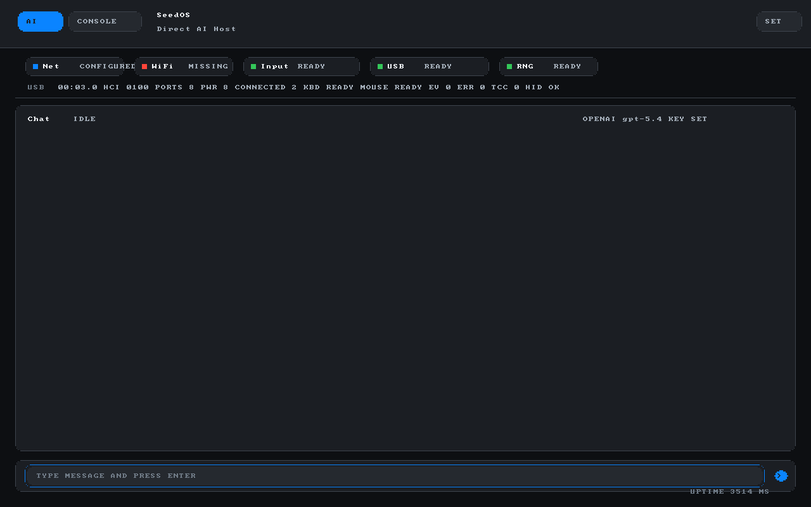
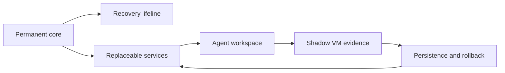
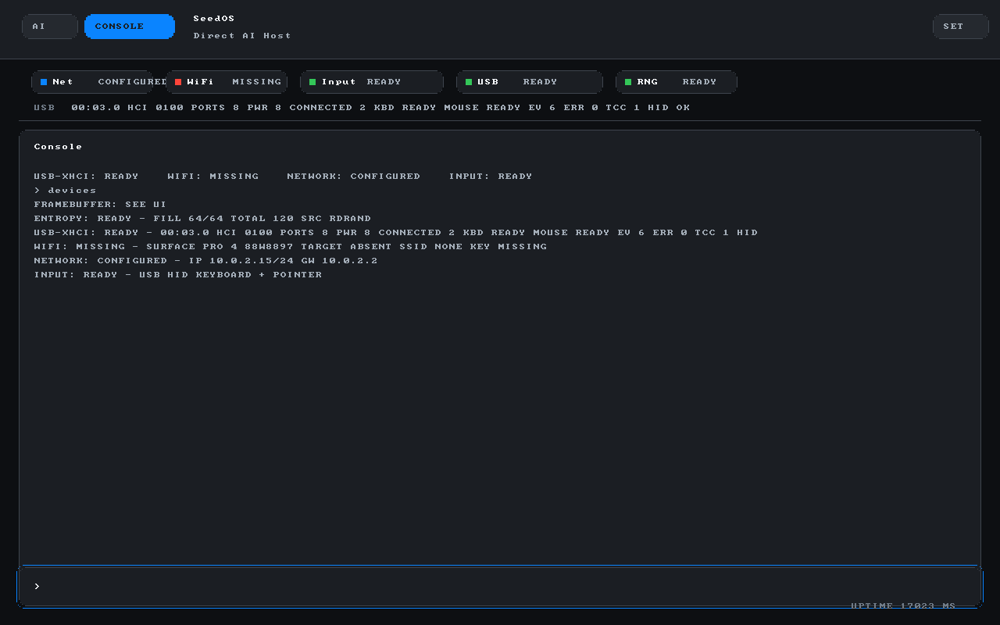
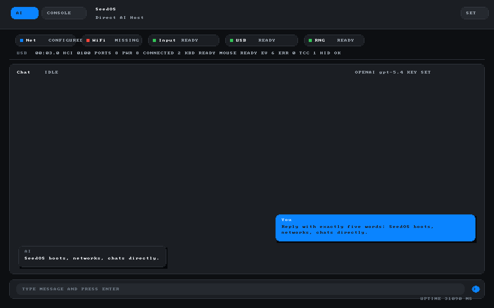

# SeedOS / RaiOS

<p align="center">
  
</p>

<p align="center">
  <strong>AI-native bootable OS seed:</strong> a tiny always-on core, a local
  agent host, and a path toward live-rebuildable services.
</p>

SeedOS/RaiOS is meant to become an AI-native, live-rebuildable operating
system: a tiny always-on recovery core plus replaceable services that an AI can
inspect, test, extend, and roll back through a native capability protocol.

The current repository is the bootable seed of that idea: an ultra-small
UEFI/Limine/Rust kernel environment that boots directly into a local agent host.
Stage-0 proves the machine can boot, show itself, accept input, bring up a
network path, and talk to an AI provider. The long-term product is the next
layer: typed self-description, static service inventory, capability policy,
Shadow-VM evidence, local attestation, persistence, rollback, and eventually
live service replacement.

## What It Is

| 🟢 SeedOS is | 🔴 SeedOS is not |
| --- | --- |
| 🟢 A real bootable OS workspace, not a hosted web app or a Linux skin. | 🔴 A Linux distribution or desktop environment. |
| 🟢 A Stage-0 kernel with framebuffer UI, serial diagnostics, input, e1000 DHCP, RAM-only provider setup, direct OpenAI transport code, a fail-closed provider trust gate, and first OpenAI cert-pin verification. | 🔴 A port of the Codex CLI into the kernel. |
| 🟢 The foundation for a native SeedOS agent protocol where every future AI action is observable, capability-gated, testable, and reversible. | 🔴 A fake cloud agent, mock provider path, or host-side serial relay. |
| 🟢 A fail-closed provider host in the normal build until TLS trust is verified. | 🔴 A complete signed-module, recovery-agent, persistence, or live-update runtime yet. |

First MVP goal:

```text
Boot in VM -> framebuffer chat UI + serial log -> network device visible -> direct AI response
```

Long-term direction:

```text
permanent core -> recovery lifeline -> replaceable services
-> agent workspace -> shadow VM evidence -> persistence and rollback
```



The larger product idea is a small OS that can connect to known AI providers
without requiring a custom dedicated cloud server. The OS should eventually
expose small capability-gated tools to an AI agent, instead of trying to run a
full host CLI such as Codex inside the kernel.

## Start Here

For humans, start here. Codex instances should already receive `AGENTS.md` as
project memory, then read the rest in this order:

1. `AGENTS.md` - working memory for Codex sessions.
2. `README.md` - repo overview.
3. `docs/PROJECT_STATUS.md` - current verified state and exact next task.
4. `docs/ROADMAP.md` - overall plan and phase boundaries.
5. `docs/DEBUGGING.md` - how to build, run, inspect, and debug the VM.
6. `docs/architecture-decisions/0001-seedos-agent-protocol.md` - core AI agent
   architecture decision.
7. `docs/SECRETS.md` - local provider-key and key-bearing artifact handling.

## Current State

The current bootable MVP artifact is:

```text
release/seedos-stage0.img
```

It has been visually verified in QEMU on Windows. It boots through Limine,
reaches the Rust kernel, negotiates a double-buffered framebuffer, draws a
chat-first Stage-0 UI with `AI`, `CONSOLE`, and `SET` modes, seeds entropy from
RDRAND, configures an Intel e1000 NIC through DHCP, and accepts input from
serial, USB-HID keyboard, USB-HID relative mouse, QEMU USB-HID tablet, and the
PS/2 fallback path. The direct OpenAI transport exists in the guest and has
verified DNS, TCP, TLS, HTTPS, and Responses API behavior in the VM path. The
normal build fails closed at the TLS trust gate unless a valid provider pin is
configured; the first OpenAI verifier slice checks the leaf certificate SHA-256
pin and TLS 1.3 signature proof before copying the API key or writing HTTPS. A
named development override can still exercise the old unverified smoke path.
The `SET` mode and `setup` command can
enter an API key into RAM without echoing the key back to the serial log.
Pointer movement uses a small framebuffer cursor overlay instead of redrawing
the full UI for every mouse delta. Tab, arrow keys, Enter, and Esc also drive a
BIOS-style focus ring for keyboard-only navigation. Stage-0 also detects the
Surface Pro 4 Marvell AVASTAR 88W8897 Wi-Fi target on PCI. The settings UI can
record a RAM-only SSID and WPA passphrase for that target, but firmware upload,
association, WPA, and Wi-Fi packet transport are not implemented yet.

Expected first screen text:

```text
AI  CONSOLE                                      SET
SEEDOS
DIRECT AI HOST
NET CONFIGURED   INPUT READY   USB READY   RNG READY
CHAT
TYPE MESSAGE AND PRESS ENTER
```

## Visual Tour

These screenshots are captured from the running QEMU VM through the VM harness.
They are not mockups.

| Console status | Provider and Wi-Fi settings |
| --- | --- |
|  |  |

| Direct AI chat, development override | Stage-0 home screen |
| --- | --- |
|  |  |

Regenerate them locally with a process-local `OPENAI_API_KEY`. The screenshot
harness uses the explicit unverified TLS development override for the chat
capture:

```powershell
powershell -NoProfile -ExecutionPolicy Bypass -File vm-harness\capture-readme-screenshots.ps1
```

## Windows Quick Commands

Build the kernel:

```powershell
powershell -NoProfile -ExecutionPolicy Bypass -File scripts\build-seed-kernel.ps1 -Profile release
```

Run the VM:

```powershell
powershell -NoProfile -ExecutionPolicy Bypass -File scripts\run-stage0-qemu.ps1 -StopExisting
```

Run the bare-metal-style VM profile with USB input and e1000 networking:

```powershell
powershell -NoProfile -ExecutionPolicy Bypass -File scripts\run-stage0-baremetal-vm.ps1 -StopExisting
```

Rebuild and repackage the boot image on Windows:

```powershell
powershell -NoProfile -ExecutionPolicy Bypass -File scripts\package-stage0.ps1 -Profile release
```

Build a local OpenAI-default image from `OPENAI_API_KEY` without touching the
tracked ESP staging directory:

```powershell
powershell -NoProfile -ExecutionPolicy Bypass -File scripts\package-stage0.ps1 -Profile release -Image release\seedos-stage0-local-openai.img -UseTempEsp -EmbedOpenAiApiKeyFromEnv
```

Add the current OpenAI leaf-certificate pin for the normal pinned-trust smoke:

```powershell
$env:OPENAI_CERT_SHA256 = "<64 hex chars>"
powershell -NoProfile -ExecutionPolicy Bypass -File scripts\package-stage0.ps1 -Profile release -Image release\seedos-stage0-local-openai.img -UseTempEsp -EmbedOpenAiApiKeyFromEnv -EmbedOpenAiCertPinFromEnv
```

Check for accidental provider-key material before committing:

```powershell
powershell -NoProfile -ExecutionPolicy Bypass -File scripts\scan-secrets.ps1
```

Run with an interactive serial console on TCP port 4555:

```powershell
powershell -NoProfile -ExecutionPolicy Bypass -File scripts\run-stage0-qemu.ps1 -StopExisting -SerialMode tcp -SerialTcpPort 4555
```

Inside the VM, type `setup` to open the OpenAI/API-key menu. Keys are stored in
guest RAM only for now and are cleared by reboot or the menu's clear command.

Run the headless direct-provider smoke test:

```powershell
powershell -NoProfile -ExecutionPolicy Bypass -File vm-harness\openai-direct-smoke.ps1
powershell -NoProfile -ExecutionPolicy Bypass -File vm-harness\openai-direct-smoke.ps1 -ExpectPinnedTrust
```

Prepare for bare-metal USB testing:

```powershell
powershell -NoProfile -ExecutionPolicy Bypass -File scripts\list-usb-disks.ps1
```

See `docs/BARE_METAL.md` before writing a USB stick. The write script is
destructive and requires an explicit disk number plus confirmation string.

Run workspace tests:

```powershell
cargo test --locked -p ota-tools -p registry-core -p registry-tools -p fake-cloud-server
```

Format check:

```powershell
cargo fmt --all -- --check
```

## Important Boundaries

- Keep Limine for the MVP. It is the boot handoff layer, not the OS runtime.
- Do not port the Codex CLI into Stage-0.
- Build a native SeedOS agent protocol with explicit capability-gated tools.
- Keep kernel changes small and boot-testable.
- Preserve `release/seedos-stage0.img` as the known bootable image until a new
  image has been tested visually and via serial logs.

## Local Convenience

There is a Desktop shortcut on this machine:

```text
C:\Users\admin\Desktop\SeedOS Codex Bypass.lnk
```

It launches Codex in this repo with approvals and sandbox disabled. Use it only
when that level of local access is intended.
