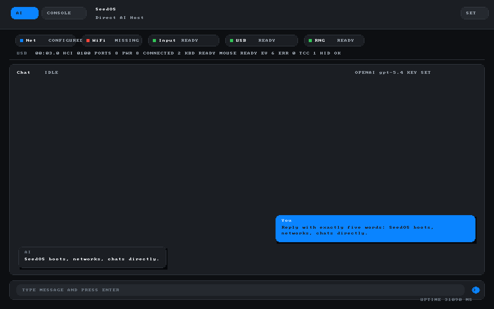
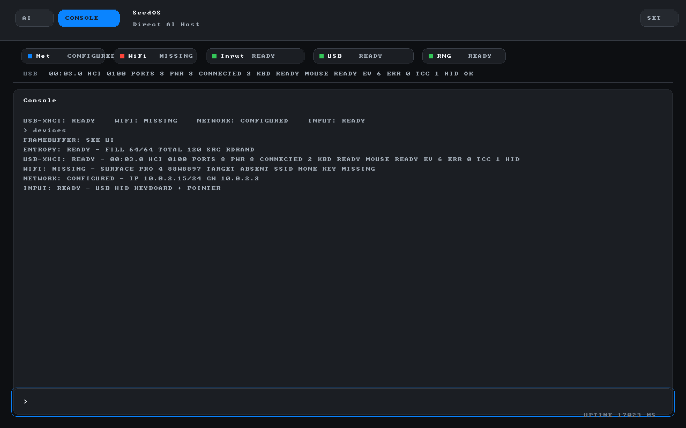
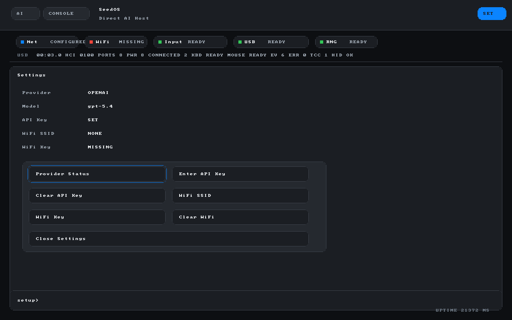
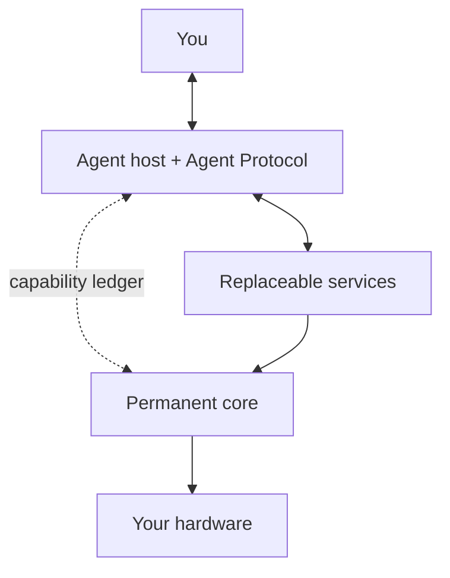

# raiOS

<p align="center">
  
</p>

<p align="center">
  <strong>A personal operating system that safely changes itself. btw its not done yet (not another custom linux kernel) </strong>
</p>

**You ask for an app. Your OS writes it, proves what it does in a sealed
shadow environment, grants it only the permissions it earned, and promotes it
into the live system — with rollback one transaction away.** That is the whole
product: an operating system whose apps are written on demand, by the machine,
for exactly one person.

raiOS starts from one bet: AI will make software cheap to create, but dangerous
to install blindly. Existing operating systems were built around static
applications and broad user authority. raiOS is built for a different loop:
ask for a tool, let an AI build it, prove what it does, grant only the
capabilities it earned, and keep rollback in reach.

It is a small, bootable OS bonded to one person and one machine. The resident
AI is the primary author of new services, but not the authority that decides
whether they may run. That authority stays local, in typed system facts:
manifests, test reports, capability grants, approvals, audit records, rollback
plans, and recovery state.

In one sentence: raiOS is a personal, self-modifying operating system where AI
can change the machine only through evidence-gated, capability-scoped system
transactions that can be rolled back.

It is what a Lisp Machine would look like if its primary user were an AI: small
enough for an agent to fully model, writable at every layer, and anchored in an
immutable recovery core that cannot be broken from above.

## Core Thesis

- Software generation is no longer scarce. Safe system change is.
- The AI can author services, but local policy authorizes them.
- Every change needs evidence before it reaches the live system.
- Capabilities are earned from tests and policy, not self-declared trust.
- Rollback and recovery are part of the OS contract, not backup features.
- System memory is typed local evidence, not chat history.

## What It Is

| 🟢 raiOS is | 🔴 raiOS is not |
| --- | --- |
| 🟢 A personal operating system bonded to one machine and one user. | 🔴 A general-purpose Linux distribution, desktop environment, or app store. |
| 🟢 A self-extending environment where an AI can inspect, build, test, and replace services under local policy. | 🔴 A cloud agent, hosted web app, or provider-locked control plane. |
| 🟢 A capability-gated system where every AI action is observable, scoped, testable, and reversible. | 🔴 A shell where an AI gets arbitrary host authority. |
| 🟢 An immutable recovery core with replaceable layers above it. | 🔴 A conventional OS with AI features bolted onto the surface. |

## Screenshots

### Console status

<p align="center">
  
</p>

The console status view exposes boot, framebuffer, entropy, USB, input, Wi-Fi,
and network state without requiring a graphical desktop or host-side helper.

### Provider and Wi-Fi setup

<p align="center">
  
</p>

`SET` mode provisions the machine entirely in-guest: provider status, RAM-only
API key entry, Wi-Fi setup. Keys never touch the disk.

### Direct provider chat

<p align="center">
  
</p>

The OS talks to the model itself. DNS, TCP, TLS, HTTPS, and response parsing
all happen inside raiOS — no browser, no host helper, no middleman process.

## The Tamagotchi Model

Most operating systems are general-purpose. They carry decades of compatibility,
drivers for hardware you'll never own, and abstractions whose only purpose is
portability. raiOS opts out. It bonds to **one machine** and **one user**, and
trades universality for surface area you and the AI can fully reason about.

The trade pays off in three directions:

- **Less to support.** Only the hardware in the box needs drivers, schedulers,
  and quirks. There is no driver matrix, no probing fallback chain, no
  least-common-denominator path.
- **More to know.** The complete system surface fits inside an agent's working
  context. The AI reasons about your real code, not an abstract OS.
- **Sharper personalization.** Capabilities, policies, and services are
  calibrated to you. The text editor you used yesterday and the one you use
  today might be entirely different programs because you implemented a few things on the side.

When you change machines, raiOS doesn't port — it re-binds, building a fresh
instance on new hardware while carrying forward your policies, modules, and
history.

## The System Is The Memory

raiOS memory is not a chatbot notebook. The system itself is the agent's
memory: typed local facts, current state, events, decisions, problems,
capability grants and denials, test evidence, rollback history, and derived
summaries with source links.

Every durable subsystem describes itself in a small, structured, classified
way. When a service learns something important, it becomes a memory record.
When an agent needs context, raiOS assembles a task-scoped `agent_context.v0`
packet — not a dump of logs, chats, or the whole memory store.

The token strategy follows from that rule:

- **Facts are authoritative.** Core ledgers, snapshots, service state,
  decisions, and VM evidence outrank summaries or semantic search hits.
- **Summaries and RAG are locators.** They help find records, but they do not
  authorize actions by themselves.
- **Context is budgeted.** The context broker chooses a profile such as
  `provider_minimal`, `diagnostic`, or `planning`, includes only relevant
  records, and reports what it omitted.
- **Provider export is gated.** Memory may leave the machine only after provider
  trust, field classification, redaction, budget, and audit rules pass.
- **No fake persistence.** Memory is durable and auditable, or it is honestly
  labeled `current_boot`. Nothing pretends.

See `docs/architecture-decisions/0004-system-memory-and-agent-context.md`.

## How It Works

raiOS is structured in three rings.

**The permanent core** is a tiny, immutable Rust kernel handed off from UEFI
through Limine. It owns boot, memory, scheduling, the framebuffer, input
devices, the recovery path, and the capability ledger. It is small enough to
audit by hand and write-protected against everything above it. If anything else
fails, the core survives.

**The agent host** runs above the core and speaks the raiOS Agent Protocol —
a typed, capability-gated interface through which an AI can read system state,
propose changes, request resources, and submit candidate services. Every tool
call is logged, scoped to declared capabilities, and refused if it exceeds
them. The host talks to AI providers through pinned-trust HTTPS over an
isolated network service, never directly from the kernel.

**Replaceable services** are everything else: networking, storage, display,
input methods, applications. Each is a signed module that runs in a constrained
capability domain. The AI can inspect them, fork them, rebuild them, and
replace them at runtime.


```mermaid
flowchart TB
    user[You]
    agent[Agent host + Agent Protocol]
    services[Replaceable services]
    core[Permanent core]
    hw[Your hardware]

    user <--> agent
    agent <--> services
    agent <-. capability ledger .-> core
    services --> core
    core --> hw
```

## Building with the AI

You ask, the agent builds. A typical interaction:

> *"I want a text editor with vim keybindings and a Markdown preview pane."*

The agent drafts a service, declares the capabilities it needs (one framebuffer
region, keyboard input, a file handle for one document), and submits the
candidate to the **Shadow VM** — a parallel execution environment that runs the
service against synthetic inputs and records evidence: syscalls made,
capabilities used, memory touched, time spent, anything reached outside the
declared scope. The recording is signed and human-readable.

If the evidence matches the declaration, the service is promoted into your live
system. If it doesn't, it never runs. Either way, the candidate, its evidence,
and its result are preserved, so promotion is auditable and rollback is one
transaction away.

Nothing the AI generates can touch the recovery core. Nothing can exceed its
declared capabilities at runtime. Nothing lands without a record.

Verification stays evidence-first without turning every tiny change into a
full release rehearsal. Small local slices get the smallest check that can
catch their failure; trust, storage, rollback, recovery, authority, provider,
descriptor, and boot changes get focused VM evidence before they are claimed.
Full VM profiles are checkpoint evidence, not the tax on every minor field or
diagnostic hop.

## The Recovery Lifeline

Because the AI has write access to almost everything, the parts it *cannot*
touch matter most. The permanent core lives in a read-only region and contains:

- The boot path
- The capability ledger and policy engine
- The Shadow VM and evidence verifier
- A minimal recovery shell with serial and framebuffer console
- An immutable rollback transaction log

If a deployed service corrupts a higher layer, the core boots cleanly into the
recovery shell, replays the rollback log to the last good state, and hands
control back to the agent. The path from "the AI broke something" to "back to
working" is measured in seconds and is impossible to break from above.

## Providers and Trust

raiOS is provider-agnostic by design. The agent host can speak to any provider
that supports a typed completion API: OpenAI, Anthropic, local inference
services, or a self-hosted model. Provider trust is anchored in pinned
certificates managed through the capability ledger, not baked into the kernel
image, so rotations are an in-system transaction rather than an image rebuild.

The default build ships with no embedded credentials. Providers are provisioned
through the `SET` mode at first boot; keys live in a sealed memory region and
never appear on disk or in logs.

## Quick Start

Build a freshly bound image for the machine in front of you:

```powershell
powershell -NoProfile -ExecutionPolicy Bypass -File scripts\package-stage0.ps1 -Profile release -Image release\raios.img
```

Boot it in a VM to try it before writing to hardware:

```powershell
powershell -NoProfile -ExecutionPolicy Bypass -File scripts\run-stage0-qemu.ps1 -StopExisting
```

Inside the running system, type `setup` to provision a provider. From there,
ask the agent for what you need.

For bare-metal installation onto the bonded machine, see `docs/BARE_METAL.md`.
The write script is destructive and requires explicit disk selection plus a
confirmation string.

## Principles

raiOS holds a small set of architectural principles that override convenience:

- **The core is small and immutable.** Everything else is replaceable.
- **Capabilities are declared and enforced.** Code that asks for more is
  refused; code that takes more without asking is impossible.
- **Evidence precedes promotion.** Candidate services run in the Shadow VM
  before they touch the live system.
- **Rollback is a first-class operation.** Every promotion is a transaction.
- **The kernel does not parse the internet.** TLS, HTTPS, and protocol parsing
  live in replaceable services with bounded capabilities.
- **The AI is a user, not an authority.** It proposes; the capability ledger
  disposes.

## Current Reality

Everything above describes the product as designed — most of it is running and
verified today, the rest is landing now. This section is the honest build
cursor.

This README intentionally stays compact. It describes the product thesis and
durable current shape, not the active engineering cursor or every verified
predicate. Read `docs/PROJECT_STATUS.md` for the authoritative detailed state,
exact next task, latest VM reports, known gaps, and implementation history;
read `docs/ROADMAP.md` for the compact phase plan and parallel work lanes.

Stable current shape:

- Stage-0 is a bootable Rust kernel handed off by Limine from UEFI.
- The kernel renders a double-buffered framebuffer UI with `AI`, `CONSOLE`,
  and `SET` modes, accepts serial input, and has QEMU HID/e1000 VM bring-up.
- The in-guest provider path can reach OpenAI through DNS, TCP, TLS, HTTPS,
  and response parsing. The current TLS path is pin/SPKI based and still lacks
  full WebPKI chain validation and trusted-time validation.
- Native read-only agent protocol surfaces exist for system/device/service/
  problem/provider/event-log style inspection, including a local-only typed
  command-envelope path for read-only dispatch.
- `svc.demo.hello` is the real current-boot built-in service test path. It
  exercises signed descriptor/artifact evidence, lifecycle/inventory,
  hot-swap/state migration, rollback preview/apply denial, test-media
  write/readback evidence, and recovery-lifeline bindings. The exact current
  slice and latest evidence live in `docs/PROJECT_STATUS.md`.
- Persistence, external unsigned artifact intake, executable candidate-byte
  mapping, provider auto-load, broad mutation, durable audit writes, rollback
  store writes, real transaction append, rollback application, and installed
  rollback state remain denied unless the status and roadmap say otherwise.
- Shadow VM smoke profiles verify boot/protocol behavior and write
  `raios.vm_test_report.v0` reports under `release/vm-reports/`.
- Shared kernel logic lives in the host-testable `raios-core` workspace
  crate (`cargo test -p raios-core` runs in under a second), including the
  single typed record model through which all agent-protocol responses and
  event bindings render — serializer and hasher derive from the same
  structure, so they cannot diverge.
- GitHub Actions builds the pinned kernel, runs the host tests, and boots
  the OS through the headless QEMU quick profile on every push.
- Every source file is below the agent-readability size thresholds; the
  former 22.7k-line hello service is 16 signature-attested modules whose
  source set is hashed and verified by the build.

Still intentionally missing:

- signed replaceable modules and an isolated runtime that can actually load
  them
- positive module/service/config mutation authority
- durable audit ledger, rollback store, persistent memory, recovery shell, and
  real transaction append
- TLS/HTTPS as a replaceable service rather than Stage-0 kernel-resident code
- broad provider trust, WebPKI, trusted time, provider-agnostic adapters, and
  production Wi-Fi support
- supported re-binding to new hardware

Document map:

- `docs/PROJECT_STATUS.md`: detailed current state, exact next task, latest
  reports, gaps, and unabridged implementation history
- `docs/ROADMAP.md`: capability milestones (M0–M12+), direction, and the
  compact active cursor
- `docs/OWNER_DASHBOARD.md`: one page, plain language, current capability
  and gate status
- `docs/DEBUGGING.md`: build, run, smoke-test, protocol-probe, and failure-mode
  commands
- `docs/architecture-decisions/`: durable protocol and memory decisions
