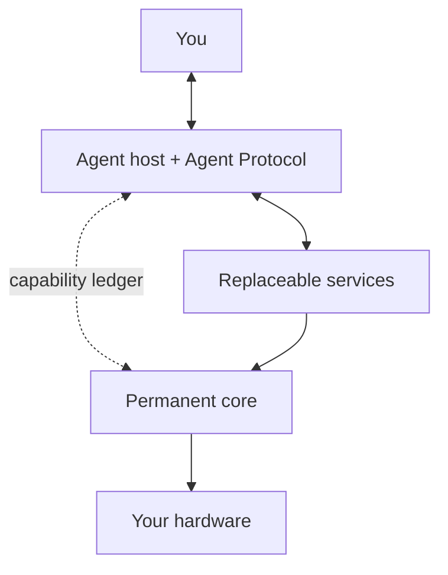

# raiOS

<p align="center">
  
</p>

<p align="center">
  <strong>A personal operating system that safely changes itself.</strong>
</p>

raiOS starts from one bet: AI will make software cheap to create, but dangerous
to install blindly. Existing operating systems were built around static
applications and broad user authority. raiOS is built for a different loop:
ask for a tool, let an AI build it, prove what it does, grant only the
capabilities it earned, and keep rollback in reach.

It is a small, bootable OS bonded to one person and one machine. The resident
AI is the primary author of new services, but not the authority that decides
whether they may run. That authority stays local, in typed system facts:
manifests, test reports, capability grants, approvals, audit records, rollback
plans, and recovery state.

In one sentence: raiOS is a personal, self-modifying operating system where AI
can change the machine only through evidence-gated, capability-scoped system
transactions that can be rolled back.

It is what a Lisp Machine would look like if its primary user were an AI: small
enough for an agent to fully model, writable at every layer, and anchored in an
immutable recovery core that cannot be broken from above.

## Core Thesis

- Software generation is no longer scarce. Safe system change is.
- The AI can author services, but local policy authorizes them.
- Every change needs evidence before it reaches the live system.
- Capabilities are earned from tests and policy, not self-declared trust.
- Rollback and recovery are part of the OS contract, not backup features.
- System memory is typed local evidence, not chat history.

## What It Is

| 🟢 raiOS is | 🔴 raiOS is not |
| --- | --- |
| 🟢 A personal operating system bonded to one machine and one user. | 🔴 A general-purpose Linux distribution, desktop environment, or app store. |
| 🟢 A self-extending environment where an AI can inspect, build, test, and replace services under local policy. | 🔴 A cloud agent, hosted web app, or provider-locked control plane. |
| 🟢 A capability-gated system where every AI action is observable, scoped, testable, and reversible. | 🔴 A shell where an AI gets arbitrary host authority. |
| 🟢 An immutable recovery core with replaceable layers above it. | 🔴 A conventional OS with AI features bolted onto the surface. |

## Screenshots

### Console status

<p align="center">
  
</p>

The console status view exposes boot, framebuffer, entropy, USB, input, Wi-Fi,
and network state without requiring a graphical desktop or host-side helper.

### Provider and Wi-Fi setup

<p align="center">
  
</p>

The `SET` mode is the first in-guest setup surface for provider status,
RAM-only API key entry, and early Wi-Fi SSID/passphrase capture.

### Direct provider chat

<p align="center">
  
</p>

The chat view shows the Stage-0 direct provider path rendering a response back
inside the framebuffer UI after DNS, TCP, TLS, HTTPS, and response parsing.

## The Tamagotchi Model

Most operating systems are general-purpose. They carry decades of compatibility,
drivers for hardware you'll never own, and abstractions whose only purpose is
portability. raiOS opts out. It bonds to **one machine** and **one user**, and
trades universality for surface area you and the AI can fully reason about.

The trade pays off in three directions:

- **Less to support.** Only the hardware in the box needs drivers, schedulers,
  and quirks. There is no driver matrix, no probing fallback chain, no
  least-common-denominator path.
- **More to know.** The complete system surface fits inside an agent's working
  context. The AI reasons about your real code, not an abstract OS.
- **Sharper personalization.** Capabilities, policies, and services are
  calibrated to you. The text editor you used yesterday and the one you use
  today might be entirely different programs because you implemented a few things on the side.

When you change machines, raiOS doesn't port — it re-binds, building a fresh
instance on new hardware while carrying forward your policies, modules, and
history.

## The System Is The Memory

raiOS memory is not a chatbot notebook. The system itself should become the
agent's memory: typed local facts, current state, events, decisions, problems,
capability grants and denials, test evidence, rollback history, and derived
summaries with source links.

Future work should make every durable subsystem describe itself in a small,
structured, classified way. If a service learns something important, it should
become a memory record or a source for one. If an agent needs context, it should
receive a task-scoped `agent_context.v0` packet assembled by raiOS, not a dump
of logs, chats, or the whole memory store.

The token strategy follows from that rule:

- **Facts are authoritative.** Core ledgers, snapshots, service state,
  decisions, and VM evidence outrank summaries or semantic search hits.
- **Summaries and RAG are locators.** They help find records, but they do not
  authorize actions by themselves.
- **Context is budgeted.** The context broker chooses a profile such as
  `provider_minimal`, `diagnostic`, or `planning`, includes only relevant
  records, and reports what it omitted.
- **Provider export is gated.** Memory may leave the machine only after provider
  trust, field classification, redaction, and audit rules pass.
- **No fake persistence.** Until the persistence and rollback layers exist,
  memory can be real but must be labeled `current_boot` or test-only.

See `docs/architecture-decisions/0004-system-memory-and-agent-context.md`.

## How It Works

raiOS is structured in three rings.

**The permanent core** is a tiny, immutable Rust kernel handed off from UEFI
through Limine. It owns boot, memory, scheduling, the framebuffer, input
devices, the recovery path, and the capability ledger. It is small enough to
audit by hand and write-protected against everything above it. If anything else
fails, the core survives.

**The agent host** runs above the core and speaks the raiOS Agent Protocol —
a typed, capability-gated interface through which an AI can read system state,
propose changes, request resources, and submit candidate services. Every tool
call is logged, scoped to declared capabilities, and refused if it exceeds
them. The host talks to AI providers through pinned-trust HTTPS over an
isolated network service, never directly from the kernel.

**Replaceable services** are everything else: networking, storage, display,
input methods, applications. Each is a signed module that runs in a constrained
capability domain. The AI can inspect them, fork them, rebuild them, and
replace them at runtime.


```mermaid
flowchart TB
    user[You]
    agent[Agent host + Agent Protocol]
    services[Replaceable services]
    core[Permanent core]
    hw[Your hardware]

    user <--> agent
    agent <--> services
    agent <-. capability ledger .-> core
    services --> core
    core --> hw
```

## Building with the AI

You ask, the agent builds. A typical interaction:

> *"I want a text editor with vim keybindings and a Markdown preview pane."*

The agent drafts a service, declares the capabilities it needs (one framebuffer
region, keyboard input, a file handle for one document), and submits the
candidate to the **Shadow VM** — a parallel execution environment that runs the
service against synthetic inputs and records evidence: syscalls made,
capabilities used, memory touched, time spent, anything reached outside the
declared scope. The recording is signed and human-readable.

If the evidence matches the declaration, the service is promoted into your live
system. If it doesn't, it never runs. Either way, the candidate, its evidence,
and its result are preserved, so promotion is auditable and rollback is one
transaction away.

Nothing the AI generates can touch the recovery core. Nothing can exceed its
declared capabilities at runtime. Nothing lands without a record.

## The Recovery Lifeline

Because the AI has write access to almost everything, the parts it *cannot*
touch matter most. The permanent core lives in a read-only region and contains:

- The boot path
- The capability ledger and policy engine
- The Shadow VM and evidence verifier
- A minimal recovery shell with serial and framebuffer console
- An immutable rollback transaction log

If a deployed service corrupts a higher layer, the core boots cleanly into the
recovery shell, replays the rollback log to the last good state, and hands
control back to the agent. The path from "the AI broke something" to "back to
working" is measured in seconds and is impossible to break from above.

## Providers and Trust

raiOS is provider-agnostic by design. The agent host can speak to any provider
that supports a typed completion API: OpenAI, Anthropic, local inference
services, or a self-hosted model. Provider trust is anchored in pinned
certificates managed through the capability ledger, not baked into the kernel
image, so rotations are an in-system transaction rather than an image rebuild.

The default build ships with no embedded credentials. Providers are provisioned
through the `SET` mode at first boot; keys live in a sealed memory region and
never appear on disk or in logs.

## Quick Start

Build a freshly bound image for the machine in front of you:

```powershell
powershell -NoProfile -ExecutionPolicy Bypass -File scripts\package-stage0.ps1 -Profile release -Image release\raios.img
```

Boot it in a VM to try it before writing to hardware:

```powershell
powershell -NoProfile -ExecutionPolicy Bypass -File scripts\run-stage0-qemu.ps1 -StopExisting
```

Inside the running system, type `setup` to provision a provider. From there,
ask the agent for what you need.

For bare-metal installation onto the bonded machine, see `docs/BARE_METAL.md`.
The write script is destructive and requires explicit disk selection plus a
confirmation string.

## Principles

raiOS holds a small set of architectural principles that override convenience:

- **The core is small and immutable.** Everything else is replaceable.
- **Capabilities are declared and enforced.** Code that asks for more is
  refused; code that takes more without asking is impossible.
- **Evidence precedes promotion.** Candidate services run in the Shadow VM
  before they touch the live system.
- **Rollback is a first-class operation.** Every promotion is a transaction.
- **The kernel does not parse the internet.** TLS, HTTPS, and protocol parsing
  live in replaceable services with bounded capabilities.
- **The AI is a user, not an authority.** It proposes; the capability ledger
  disposes.

## Current Reality

This repository is the Stage-0 seed of raiOS: a bootable Rust kernel that proves
the machine can come up, render a UI, accept input, reach the network, expose a
native agent protocol, and deny unsafe system mutation through typed evidence.

Verified in the VM today:

- UEFI/Limine boot into the higher-half Rust kernel
- framebuffer UI with `AI`, `CONSOLE`, and `SET` modes
- serial command input plus USB-HID keyboard, mouse, and tablet input in QEMU
- Intel e1000 DHCP networking and entropy from RDRAND
- direct OpenAI transport through DNS, TCP, TLS 1.3, HTTPS, and Responses API parsing
- fail-closed provider trust gates for SPKI or leaf-certificate pins
- native serial `raios.agent.v0` read-only methods for snapshot, capabilities,
  service inventory, problem state, memory context, event log, and provider gates
- RAM-only current-boot event evidence and provider-minimal context projection,
  with provider export and automatic context injection still denied
- denied-by-default module and recovery load boundaries with retained hash
  references, audit/rollback diagnostics, service-slot diagnostics, loader-runtime
  diagnostics, and Shadow VM evidence
- first positive RAM-only service lifecycle:
  `module.load_ephemeral svc.demo.hello` consumes a typed current-boot load
  descriptor from a validated current-image descriptor-source record, exposes
  `svc.demo.hello` through `service.inventory`, supports health/stop/drop, and
  leaves RAM-only lifecycle and health audit events bound to the same descriptor
  source hash and a verified P-256/SHA-256 descriptor-source signature envelope;
  `service.descriptor_source_trust_selftest` proves valid and tampered envelope
  cases fail closed without accepting descriptor or artifact bytes;
  a second `host_bound:svc.demo.hello` path uses a host-produced
  descriptor-source candidate that binds the current-image source hash while
  still loading only the built-in current-boot service
- Phase-6 normal-module loader diagnostics through descriptor/artifact intake,
  execution authorization, service-registry mutation, live-load attempt,
  artifact-load, executable-mapping, entrypoint-transfer, service-start,
  service-health-binding, service-running-state, service-start-audit, and
  service-unload-cleanup boundaries, plus live-load commit, commit-audit,
  commit-rollback, commit-result, descriptor-acceptance authority,
  descriptor-parser contract, descriptor-parser result, and descriptor
  schema-validation, capability-validation, load-plan, executable load-plan
  authority/result, executable image-layout, executable page-mapping plan, and
  executable page-mapping, descriptor/executable-page binding, and executable
  entrypoint binding, executable entrypoint transfer authorization, executable
  entrypoint transfer, and executable entrypoint handoff boundaries, all still
  non-authorizing
- a Shadow VM smoke harness that verifies the real boot and serial protocol path
  and writes `raios.vm_test_report.v0` reports

Still intentionally missing:

- signed replaceable modules and an isolated runtime that can actually load them
- positive module/service/config mutation authority
- durable audit ledger, rollback store, persistent memory, and recovery shell
- TLS/HTTPS as a replaceable service instead of kernel-resident Stage-0 code
- Wi-Fi firmware upload, association, WPA, and packet transport
- broad provider trust, WebPKI, and provider-agnostic adapters
- re-binding to new hardware as a supported flow

The detailed, unabridged current state and exact next engineering task live in
`docs/PROJECT_STATUS.md`. The phase plan lives in `docs/ROADMAP.md`; build,
run, and smoke-test commands live in `docs/DEBUGGING.md`; the foundational
protocol and memory decisions live in `docs/architecture-decisions/`.
